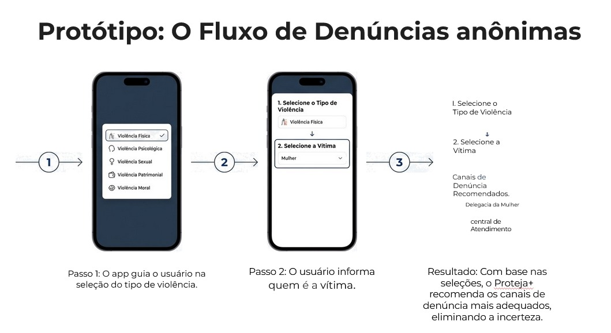
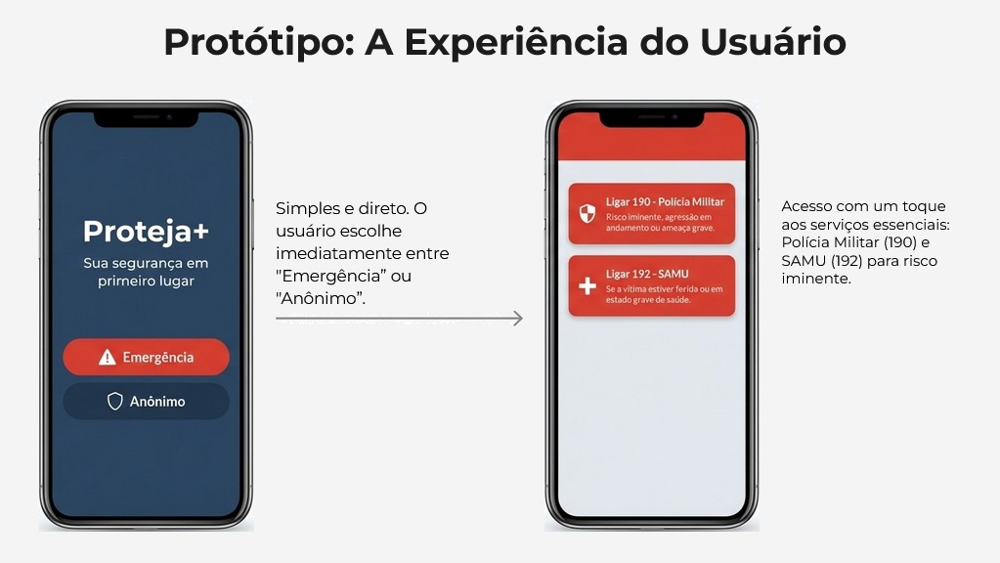
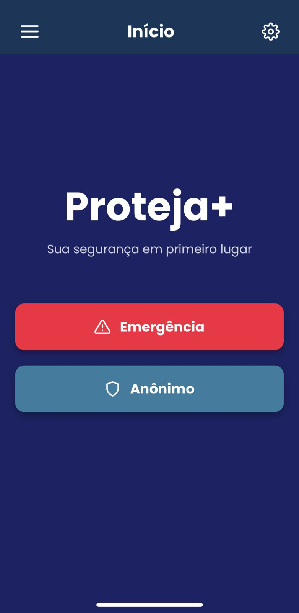
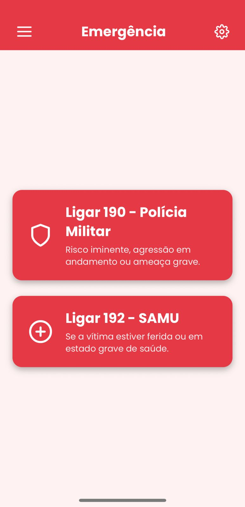
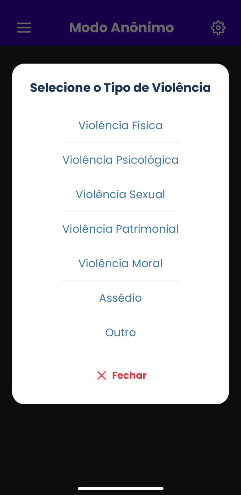
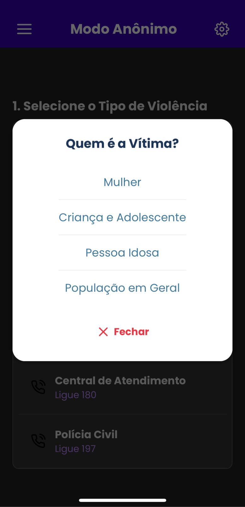

# Proteja+: Um aplicativo para denúncias e segurança comunitária 🛡️

O **Proteja+** é um software (aplicativo móvel) desenvolvido como um **projeto de extensão** vinculado à **Universidade Estadual de Goiás (UEG) - Campus Trindade**. O projeto visa fortalecer a proteção social e o combate à violência através da tecnologia.

## 👨‍🏫 Orientação e Coordenação
- **Orientador:** Professor e Coordenador Jose Ricardo Cosme Lerias Ribeiro.

## 👥 Equipe de Desenvolvimento (Colaboração Ativa)
- **Thalles Henrique Alves** (Desenvolvedor Principal)
- **João Manoel Silva Morais**
- **Joás Rodrigues Pereira**

### Participantes (Projeto de Extensão)
- Gabriel Henrique Damaceno Alves
- Italo Gabriel Stefaisk
- Pedro Lucas Hipolito de Oliveira
- Wanessa Luna de Oliveira Silva

## 🛠️ Metodologia e Processo de Desenvolvimento
O projeto adotou **metodologias ágeis** e foi validado junto ao cliente final. O desenvolvimento seguiu um rigoroso padrão acadêmico e técnico:
- **Documento de Requisitos:** Levantamento das demandas sociais junto ao **CREAS**.
- **Diagrama de Caso de Uso:** Mapeamento das interações dos usuários.
- **Fluxo do Processo (BPMN):** Modelagem do fluxo de atendimento às vítimas.
- **Protótipo de Telas:** Design de interface focado em usabilidade e acessibilidade.

## 💻 Stack Tecnológica
O app foi construído com ferramentas modernas para garantir performance e portabilidade:

- **Framework:** **Expo (SDK 53/54)** para um desenvolvimento ágil e multiplataforma.
- **Core:** **React Native** com foco em componentes nativos.
- **Linguagem:** **JavaScript** (ES6+).
- **Navegação:** **React Navigation** utilizando padrões de *Drawer* e *Native Stack* para uma fluidez intuitiva.
- **Interface e Estilização:** - **Poppins Fonts:** Tipografia focada em legibilidade.
  - **Feather Icons:** Conjunto de ícones minimalistas para identificação rápida de funções.
  - **React Native Safe Area Context:** Garantia de que a interface ocupe 100% da tela de forma segura em qualquer dispositivo.
- **Animações:** **React Native Reanimated** para transições suaves e interações táteis (feedback visual em botões).

## 🚀 Funcionalidades Principais
- **Central de Emergência:** Ação imediata de socorro.
- **Modo Anônimo:** Denúncia segura sem identificação do usuário.
- **Segurança de Dados:** Limpeza de estado e encerramento seguro da aplicação.
- **Interface Edge-to-Edge:** Uso completo da tela respeitando Safe Areas.

## 📸 Demonstração
| Fluxo de Denúncia | Protótipo de Experiência | Home |
|---|---|---|
|  |  |  |

| Tela de Emergência | Opções de Denúncia | Tipo de Vítima |
|---|---|---|
|  |  |  |

## 🎓 Resultados e Impacto Social
A execução resultou em um aplicativo intuitivo que contribui para:
- **Social:** Ampliar o acesso de grupos vulneráveis (crianças, mulheres) a canais confiáveis de denúncia.
- **Cultural:** Fomentar uma cultura de prevenção e cuidado comunitário.
- **Econômico:** Otimização de recursos públicos ao centralizar informações e subsidiar órgãos com dados organizados.

## 🏗️ Infraestrutura Utilizada
Ação desenvolvida nos laboratórios de informática da **UEG Campus Trindade**, utilizando suporte técnico e internet institucional.